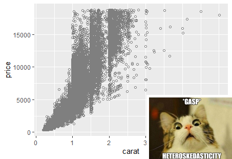

```{r setup, include=FALSE}
knitr::opts_chunk$set(echo = FALSE)
knitr::opts_chunk$set(fig.width=5, fig.height=2) 
library("lfe")
library("stargazer")
library(wooldridge)
library(magick)
library(dplyr)
library(robustbase)
library(stargazer)

```


# Review: Simple Linear Regression

## Reg Review: Related random variables

Values of two (or more) random variables might be related: 

- (X,Y)=(height, weight) of a person
- (X,Y)=(sqft, bedrooms) of a home
- (X,Y)=(price, quantity demanded) of a product
- (X,Y)=(speed, stopping distance) of a car


How can we understand these relationships?


## Reg Review: Line of best fit

\tiny
```{r, echo=TRUE}
library(ggplot2)
#here I use the cars data which is a part of base R
my_plot_stats<-ggplot(data = cars, aes(x =speed, y = dist))+
    geom_point(size=1)+
  labs(x = "Car speed (mph)", y = "Stopping distance (ft)")+
  theme_minimal()
my_plot_stats
```

\normalsize
Let's draw a line:  $Y=\beta+0+\beta_1X$ and select $\beta_0$ and $\beta_1$ to ``fit'' the data as \textit{closely} as possible.

## Reg Review: Line of best fit


Usually we do this with OLS (Ordinary Least Squares): minimizing the sum of squared residuals. 

\tiny
```{r, echo=TRUE, warnings=FALSE, message = FALSE}
library(ggplot2)
my_plot_stats2<-ggplot(data = cars, aes(x =speed, y = dist))+
  geom_point(size=1)+
  geom_smooth(method='lm', se = FALSE)+
  labs(x = "Car speed (mph)", y = "Stopping distance (ft)")+
  theme_minimal()
my_plot_stats2
```

\normalsize

## Reg Review: Conditional expectation

The line gives the \textbf{Conditional expectation}: $E[Y|X]=\beta_0+\beta_1X$ 

- Example: $E[stopping distance|speed]$

- the line gives us a unique expected value for any speed

What are the values of $\beta_0$ and $\beta_1$?
\tiny
```{r, echo=TRUE}
cars_reg<-lm(dist~speed, cars)
cars_reg
```
\normalsize

So $\text{Distance}=-17.6+3.9 \text{Speed}$

- when speed is 15mph, we predict a stopping distance of 41.


## Reg Review: The errors


 For an observation $i$, the actual observed outcome $Y_i$ will differ from the expected outcome $\hat{Y}_i$ given its  $X_i$ because of random unknown factors we call the error ( $\epsilon_i$). 

- for a specific observation $i$ we can represent the actual outcome $Y_i$ as:
$Y_i=\beta_0+\beta_1X_i+\epsilon_i$

- its predicted outcome $\hat{Y}_i$ is:
$\hat{Y}_i=\beta_0+\beta_1X_i$

- the error, or \textbf{residual}, is $\epsilon_i=Y_i-\hat{Y}_i$

These errors are normally distributed, with $E[\epsilon]=0$ and a constant variance.

## Reg Review: The errors

   

## Reg Review: Interpretation

Model: $Dist=\beta_0+\beta_1 Speed$

\tiny
```{r, echo=TRUE}
reg1<-lm(dist~speed, cars)
summary(reg1) #For a more detailed summary that includes standard errors
```
\normalsize

$\beta_1=3.9$ (se=0.42). How should we interpret this coefficient? 

## Reg Review: Interpretation

3 elements you want to touch upon (the three S'):

1) **Sign**- is the coefficient you are discussing positive or negative? Does the sign of the coefficient match your priors or is it surprising?

2) **Size**- What is the magnitude of the coefficient? Is the effect of $x$ on $y$ economically meaningful or not? Make your interpretation informative to your audience, by being precise.

3) **Significance**- Is the estimate statistically significant? Can we reject that the true coefficient is equal to zero? With what confidence level?

## Reg Review: Interpretation

Model: $Dist=\beta_0+\beta_1 Speed$

$\beta_1=3.9$ (se=0.42)

Each additional mile per hour of speed predicts an increase in the stopping distance of 3.9 feet. This relationship is highly statistically significant. We can reject the null of no relationship at the 99% confidence level.

## Reg Review: Scaling

Generally good to use intuitive units of measurement.
\tiny
```{r, echo=TRUE}
reg_USunits<-lm(dist~speed, cars)
reg_USunits 
```
\normalsize
The European in me does not like the regression where distance is measured in feet (whose feet? not my foot) and miles per hour... my heart belongs to the metric system. 

- You can rescale when you interpret the coefficients
- Or before running the regression

## Reg Review: Scaling
\tiny
```{r, echo=TRUE}
cars$speed_kmh=cars$speed*1.61 #1 foot=0.3 meters
cars$dist_m=cars$dist*0.3 #1 mile=1.61 km

reg_metric1<-lm(dist_m~speed, cars)
reg_metric1 
```
\normalsize
Scaling $Y$ by $c=0.3$: all coefficients get multiplied by $c$
\tiny
```{r, echo=TRUE}
reg_metric2<-lm(dist_m~speed_kmh, cars)
reg_metric2 
```
\normalsize
Scaling $X_1$ by $c=1.61$: $\beta_1$ gets divided by $c$

# Reg Review: Multivariate regression

## Reg Review: Multivariate regression

What if we have more than 1 explanatory variable? 

$$
Y=\beta_0+\beta_1X_1+\beta_2X_2+...+\beta_kX_k+\epsilon
$$

- Most of what we discussed is similar.

- Key difference: when interpreting the coefficient for one variable we are ``keeping all other variables fixed''

Some models also become more complicated:

- Categorical variables

- Interaction terms

- Quadratic specifications

- Log specifications

## Reg Review: Categorical variables

I make a variable (\textit{Man}):\textit{Man}=1 for men, 0 for women. 

I estimate the model: $\text{Earnings}=\beta_0+\beta_1\text{Man}+\epsilon$
\tiny
```{r, echo=TRUE}
data<-read.csv("CPSSW8.csv")

data$man<-NA
data$man[data$gender=="male"]<-1
data$man[data$gender=="female"]<-0

model<-lm(earnings~man, data)
model
```
\normalsize

- $\hat{\beta_0}=16.3$, the estimate for the omitted category (Women)

- $\hat{\beta_1}=3.7$, the estimated difference between Men and the omitted category.

## Reg Review: Categorical variables


For men the variable Man=1, so predicted earnings are
$$
\widehat{\text{Earnings}}=16.3+3.7 (1)=20
$$
For women the variable Man=0, so predicted earnings are
$$
\widehat{\text{Earnings}}=16.3+3.7 (0)=16.3
$$
This simple regression on a categorical variable essentially gives us the mean earnings of men and women.


\tiny
```{r}
gender<-ggplot(data, aes(y=fitted.values(model),x=age,color=gender)) +
  geom_line() + ylim(0,30)+
  labs(x = "Age", y = "Earnings")+
  theme_minimal()
gender
```
\normalsize

## Reg Review: Categorical variables
Now, I estimate the model: $\text{Earnings}=\beta_0+\beta_1\text{Man}+\beta_2 \text{Age}+\epsilon$
\tiny
```{r, echo=TRUE}
model2<-lm(earnings~man+age, data)
model2
```
\normalsize

So $\hat{\beta_0}=8.8$ and $\hat{\beta_1}=3.8$ and $\hat{\beta_2}=0.18$

## Reg Review: Categorical variables


For men the variable Man=1, so predicted earnings are
$$
\widehat{\text{Earnings}}=8.8+3.8 (1)+0.18 \times \text{Age}=12.6+0.18 \times \text{Age}
$$
For women the variable Man=0, so predicted earnings are
$$
\widehat{\text{Earnings}}=8.8+3.8 (0)+0.18 \times \text{Age}=8.8+0.18 \times \text{Age}
$$

\tiny
```{r}
gender2<-ggplot(data, aes(y=fitted.values(model2),x=age,color=gender)) +
  geom_line() + ylim(0,30)+
  labs(x = "Age", y = "Earnings")+
  theme_minimal()
gender2
```
\normalsize


## Reg Review: Interaction terms
Now, I estimate the model: $\text{Earnings}=\beta_0+\beta_1\text{Man}+\beta_2 \text{Age}+\beta_3 \text{Age}\times\text{Man}+\epsilon$
\tiny
```{r, echo=TRUE}
model3<-lm(earnings~man+age+age*man, data)
model3
```
\normalsize

So $\hat{\beta_0}=11.3$ and $\hat{\beta_1}= -0.6$ and $\hat{\beta_2}= 0.12$ and $\hat{\beta_3}=0.11$

## Reg Review: Interaction terms

\small
For men the variable Man=1, so predicted earnings are
$$
\widehat{\text{Earnings}}=11.3+(-0.6)(1)+0.12 \times \text{Age}+0.11 (1)\times \text{Age}=10.7+0.23 \times \text{Age}
$$
For women the variable Man=0, so predicted earnings are
$$
\widehat{\text{Earnings}}=11.3+(-0.6)(0)+0.12 \times \text{Age}+0.11 (0)\times \text{Age}=11.3+0.12 \times \text{Age}
$$

\tiny
```{r}
gender3<-ggplot(data, aes(y=fitted.values(model3),x=age,color=gender)) +
  geom_line() + ylim(0,30)+
  labs(x = "Age", y = "Earnings")+
  theme_minimal()
gender3
```
\normalsize


## Reg Review:  Non-linear specifications: Quadratic

We are interested in the relationship between age and sleep. 

- Do you think this relationship is linear? Who sleeps a lot? 


If the data is ``curved'', specify a quadratic by adding a squared term to the specification.

$$
sleep=\beta_0+\beta_1 age+\beta_2 age^2+u
$$
\tiny
```{r, echo=TRUE, warnings=FALSE, message = FALSE}

sleep75$age2<-sleep75$age*sleep75$age
regquad<-lm(sleep~age+age2, sleep75)
regquad
```

## Reg Review:  Non-linear specifications: Quadratic


When interpreting a variable that includes a quadratic, the marginal effect of the variable is not linear

- how an additional year of age affects sleeps depends on how old you are.


- To see this, take the derivative of sleep with respect to age:
$$
\frac{dsleep}{dage}=\beta_1+2*\beta_2*age=-21.5+2\times 0.3 \times age=-21.5+0.6 \times age.
$$

Getting older means less sleep until you are 35. Then more.

When interpreting the marginal effect:

- specify the X at which you are interpreting at,

- give a sense of the effect of a unit increase in X at different key points of the distribution of X.


## Reg Review: Log variables


What if your data is not linear, or quadratic?

```{r, warnings=FALSE, message = FALSE}
apple<-read.csv("AppleJuice.csv")
my_plot_apple<-ggplot(data = apple, aes(x =Sales, y = Price))+
  geom_point(size=1)+
  geom_smooth(method='lm', se = FALSE)+
  theme_minimal()
my_plot_apple
```

Does this line do a good job of fitting the data? 


## Reg Review: Log variables


Using log's to transform a variable can greatly improve the fit of your model. 

```{r, warnings=FALSE, message = FALSE}
apple<-read.csv("AppleJuice.csv")

apple$logSales<-log(apple$Sales)

my_plot_apple<-ggplot(data = apple, aes(x =logSales, y = Price))+
  geom_point(size=1)+
  geom_smooth(method='lm', se = FALSE)+
  theme_minimal()
my_plot_apple
```

When you do this, you need to then adjust your interpretation accordingly.


## Reg Review: Log adjusted interpretation


Linear:
 
  - $y=\beta_0+\beta_1 x$
  - Interpretation: $\Delta y=\beta_1 \Delta x$ 
  
Logarithmic:

  - $y=\beta_0+\beta_1 log(x)$
  - Interpretation: $\Delta y=\beta_1 \frac{\% \Delta x}{100}$
  
Exponential:

  - $log(y)=\beta_0+\beta_1 x$
  - Interpretation: $\% \Delta y=\beta_1 \Delta x \times 100$ 

Log-Log (an elasticity):

  - $log(y)=\beta_0+\beta_1 log(x)$
  - Interpretation: $\% \Delta y=\beta_1 \%\Delta x$ 
  
  
# New?: Non-standard standard errors

##  Non-standard standard errors

A standard error estimates the uncertainty around an estimated parameter. 

Formally we have
$$
se=\sqrt{\widehat{Var(\hat{\beta})}}. 
$$


Just like calculating $\hat{\beta}$, it is incredibly important to get your standard errors right. 

You have to know what you don't know!

- Robust standard errors

- Clustered standard errors


## Robust standard errors

Using the diamonds data set from `ggplot2`: regress price on carats.

\tiny
```{r robusta, echo=TRUE}

reg1<-felm(price~carat, diamonds)

summary(reg1)
```

## Robust standard errors

Cool. 

Plot  the data to check OLS assumptions:

\tiny
```{r rob, echo=TRUE}

myPlot <- ggplot(data = diamonds, aes(y = price, x = carat)) +
geom_point(color = "gray50", shape = 21) 

```


## Robust standard errors

```{r}


imgin <- image_read("images/scared_cat.jpg")
imgout <- image_read("images/Rplot01.png")

img_inset <- image_scale(imgin, "27%x") %>% 
  image_border("white", "5x5")

img_with_inset <- imgout %>% image_composite(
  img_inset,
  operator = "Atop",
  gravity = "SouthEast",
  offset = "-10-10"
)

image_write(img_with_inset, "img_with_inset.png")
```


```{r}

```


## Robust standard errors


You should have the econometric heebie jeebies.

Homoskedastic assumption needed for OLS is not valid!

- The higher the carat, the greater the variance in price. 

- $\Rightarrow$ OLS standard errors are likely to be wrong. 

Thankfully all is not lost!

## Eicker, Huber and White to the rescue!


Econometricians Eicker, Huber and White figured out a way to do calculate "robust", or "heteroskedasticity-robust" standard errors.

Robust standard errors are larger than regular standard errors, and thus more conservative (which is the right thing to be... you want to know what you don't know). 

## Robust standard errors

How can we find these in R? 

 \tiny
```{r robustaa, echo=TRUE}

reg1<-felm(price~carat, diamonds)

summary(reg1, robust=TRUE)
```

## Robust standard errors

Or if you want to put them in a stargazer table:
\tiny 
```{r robustaaa, echo=TRUE, results="asis"}

stargazer(reg1, type = "latex" , se =  list(reg1$rse), header=FALSE)
```


## Clustered standard errors

 
 
 \pause
 
\center{
\textbf{Econometricians Haiku}

T-stats looks too good

Try cluster standard errors

significance gone.

\bigskip

\small
from Angrist and Pischke 2008

}


## Clustered standard errors

Suppose that every observation belongs to (only) one of G groups. 

The assumption we make when we cluster:

- there is no correlation across groups

- we allow for arbitrary within-group correlation.

Need to have a fairly large number of clusters (40+) for the estimate to be credible.

## Clustered standard errors

Example: consider individuals within a village.

It may be reasonable to think that individuals' error terms are:

- correlated within a village

- aren't correlated across villages 

## Clustered standard errors

When should I cluster?


Where does the variation in your explanatory variable come from? 

- Variation between individual observations?

- Variation between groups of observations?

If the variation comes from group level variation, cluster by groups. 


## Clustered standard errors

Recall our olympics data

\tiny
```{r, echo=TRUE}
olympics <- read.csv("olympics_data.csv")
olympics2<-olympics %>% select(country, year, type, gold, silver, bronze, population, gdp)%>% 
  filter(type == "summer" & !is.na(population) & !is.na(gdp)) %>%
  mutate(total = gold + silver + bronze) 

olympics2<-olympics2%>%mutate(gdp_percap=gdp/population, total_percap=total/population)%>%
  filter(total_percap<12,  gdp_percap<60)

my_plot1<-ggplot(data = olympics2, aes(x = gdp_percap, y = total_percap))+
  geom_point(size=2, shape=23)+
  theme_minimal()
my_plot1

```
\normalsize

## Clustered standard errors

\tiny
```{r, echo=TRUE, results='asis'}
reg1<-felm(total_percap~gdp_percap, olympics2)
reg2<-felm(total_percap~gdp_percap|0|0|country, olympics2)

stargazer(reg1, reg2, type = "latex", header=FALSE)

```
\normalsize

